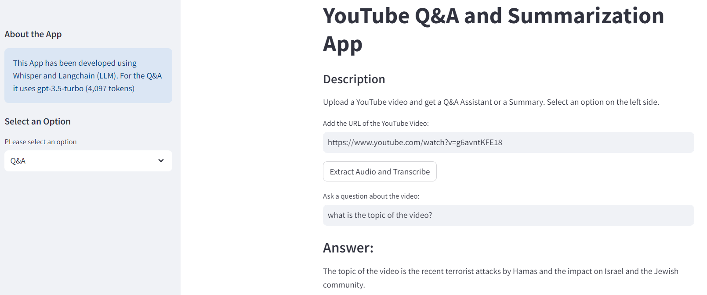
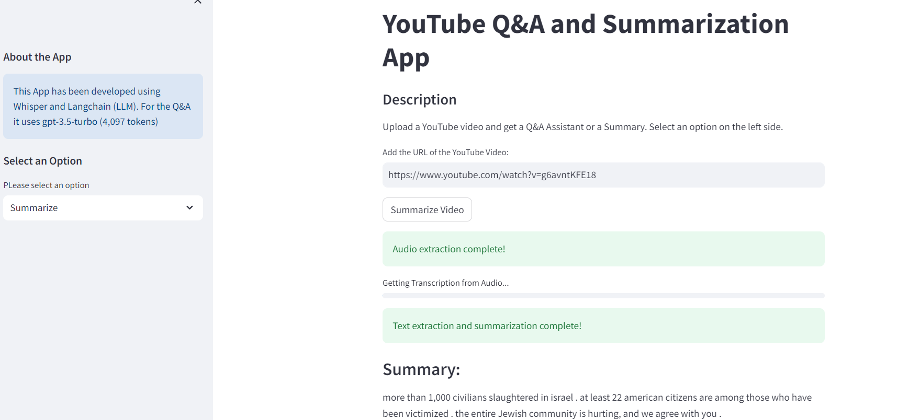

# YOUTUBE Q&A AND SUMMARIZATION APP 📺

<p align="center">
    
</p>

This repository hosts an app developed using **Whisper** and **Langchain** that allows to create a Q&A assistant and video summarization. The model's maximum context length is 4097 tokens (gpt-3.5-turbo).

The App can be run locally but requires an `OPENAI_API_KEY` in the `.env` file

## 👨‍💻 **Tech Stack**


## 💬 Set Up

 I recommend to install the modules in the following order. The `ffmpeg` module is required for the proper functioning of the application. You can install it using Conda as follows:

```bash
conda install -c conda-forge ffmpeg
```

```bash
pip install git+https://github.com/openai/whisper.git
```

```bash
pip install -r requirements.txt
```

## 🫵 App Deployment

The up can be used running `streamlit run app.py` in the terminal. There are 2 options on the side bar, Q&A or Summarize. I recommend using videos no longer than 5 min of speech due to the model tokens' limitations.

The first option allows a Q&A assistant to ask questions about the video.

<p align="center">
    
</p>

The second option allows us to get a summary of the video.

<p align="center">
    
</p>

